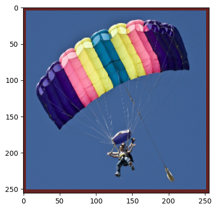

This tutorial demonstrates how to train VQGAN in JAX/Flax using our pipeline. For the tutorial, we will train on [imagenette](https://www.tensorflow.org/datasets/catalog/imagenette) datasets.

Note: This notebook will be reevaluated when I get access to GPU in order to fully train this model, but for now I am poor jobless person 😞.


```python
# Install dependencies
%pip install -r ../requirements.txt

# you can also create virtual environment and install dependencies with
%invoke venv # recommended
```

## 1. Imports

Import OmegaConf, LoadConfig, TrainerVQGan, DataLoader, and TensorflowDataset. [OmegaConf](https://omegaconf.readthedocs.io/en/2.2_branch/#) is a library which will handle loading the yaml file with our configs. Our pipeline is basically managed with yaml files that specify yhe architecture, trainer, dataset loading, and processing. LoadConfig is our dataclass config, which will take omegaconf dict and prepare configs for training and data loading. TensorflowDataset and DataLoader are our objects for preparing datasets and creating something similar to PyTorch data loaders. Lastly, TrainerVQGan is the object that will take care of creating, training, and logging models.


```python
# External libraries
# flake8: noqa: E402
import sys

from omegaconf import OmegaConf

# Internal libraries
sys.path.insert(0, "../")
from modules.config import LoadConfig
from modules.training import TrainerVQGan
from modules.utils import DataLoader, TensorflowDataset
```

    /Users/vladimirzaigrajew/Documents/projects/jax-vqgan/myenv/lib/python3.8/site-packages/tqdm/auto.py:22: TqdmWarning: IProgress not found. Please update jupyter and ipywidgets. See https://ipywidgets.readthedocs.io/en/stable/user_install.html
      from .autonotebook import tqdm as notebook_tqdm
    WARNING:absl:GlobalAsyncCheckpointManager is not imported correctly. Checkpointing of GlobalDeviceArrays will not be available.To use the feature, install tensorstore.


## 2. Load configs
Now let's load our training configs. For now we created three sample configs located in the `conf` folder:
- `config.yaml` my training config
- `imagenet.yaml` official training config for training on the imagenet dataset
- `gumbel.yaml` official training config with Gumbel-max trick on the imagenet dataset

You can create your own config if you want to, but for this tutorial we will use `config.yaml`.


```python
config_path = "../conf/config.yaml"
cfg_omega = OmegaConf.load(config_path)
print(OmegaConf.to_yaml(cfg_omega))
```

    train:
      model_name: vqgan_imagenette
      model_hparams:
        embed_dim: 256
        n_embed: 1024
        double_z: false
        z_channels: 256
        in_channels: 3
        out_ch: 3
        ch: 128
        ch_mult:
        - 1
        - 1
        - 2
        - 2
        - 4
        act_name: gelu
        num_res_blocks: 2
        attn_resolutions:
        - 16
        dropout: 0.0
      disc_hparams:
        input_last_dim: 3
      save_dir: ../../datasets/vqgan_model_save
      log_dir: ../../datasets/vqgan_log_dir
      check_val_every_n_epoch: 1
      log_img_every_n_epoch: 5
      input_shape:
      - 256
      - 256
      - 3
      codebook_weight: 1.0
      monitor: total_loss
      recon_loss: l1
      disc_loss: hinge
      disc_weight: 0.8
      num_epochs: 10
      dtype: float32
      distributed: false
      seed: 42
      optimizer:
        _target_: optax.adamw
        learning_rate: 4.5e-06
        b1: 0.9
        b2: 0.999
        weight_decay: 0.0001
      optimizer_disc:
        _target_: optax.adamw
        learning_rate: 4.5e-06
        b1: 0.9
        b2: 0.999
        weight_decay: 0.0001
      disc_start: 7
      temp_scheduler: null
    data:
      train_params:
        batch_size: 4
        shuffle: true
      test_params:
        batch_size: 8
        shuffle: false
      dataset_name: imagenette
      dataset_root: ../../datasets
      transform:
        __version__: 1.3.0
        transform:
          __class_fullname__: Compose
          additional_targets: {}
          bbox_params: null
          keypoint_params: null
          p: 1.0
          transforms:
          - __class_fullname__: RandomBrightnessContrast
            always_apply: false
            brightness_by_max: true
            brightness_limit:
            - -0.1
            - 0.1
            contrast_limit:
            - -0.2
            - 0.2
            p: 0.5
          - __class_fullname__: HorizontalFlip
            always_apply: false
            p: 0.5
      size: 256


We can see that there are two `train` sections, which corresponds to setting the trainer and architectures, and `data` specifying the datasets, augmentation and preprocessing.


```python
cfg_omega_dict = OmegaConf.to_container(cfg_omega)
cfg_omega_dict["train"]["num_epochs"] = 1  # reduce number of epochs for testing
cfg = LoadConfig(**cfg_omega)
print(cfg)
```

    LoadConfig(train=TrainConfig(model_name='vqgan_imagenette', model_hparams=VQGANConfig {
      "act_name": "gelu",
      "attn_resolutions": [
        16
      ],
      "beta": 0.25,
      "ch": 128,
      "ch_mult": [
        1,
        1,
        2,
        2,
        4
      ],
      "double_z": false,
      "dropout": 0.0,
      "embed_dim": 256,
      "give_pre_end": false,
      "gumb_temp": 1.0,
      "in_channels": 3,
      "kl_weight": 0.0005,
      "n_embed": 1024,
      "num_res_blocks": 2,
      "num_resolutions": 5,
      "out_ch": 3,
      "resamp_with_conv": true,
      "resolution": 256,
      "transformers_version": "4.24.0",
      "use_gumbel": false,
      "z_channels": 256
    }
    , disc_hparams=DiscConfig {
      "input_last_dim": 3,
      "n_layers": 3,
      "ndf": 64,
      "output_last_dim": 1,
      "resolution": 256,
      "transformers_version": "4.24.0"
    }
    , save_dir='../../datasets/vqgan_model_save', log_dir='../../datasets/vqgan_log_dir', check_val_every_n_epoch=1, log_img_every_n_epoch=5, input_shape=(256, 256, 3), codebook_weight=1.0, monitor='total_loss', recon_loss='l1', disc_loss='hinge', disc_weight=0.8, num_epochs=10, dtype=<class 'jax.numpy.float32'>, distributed=False, seed=42, optimizer=GradientTransformation(init=<function chain.<locals>.init_fn at 0x7fb5569c9e50>, update=<function chain.<locals>.update_fn at 0x7fb5569c9f70>), optimizer_disc=GradientTransformation(init=<function chain.<locals>.init_fn at 0x7fb5569e6310>, update=<function chain.<locals>.update_fn at 0x7fb5569e63a0>), disc_start=7, temp_scheduler=None), data=DataConfig(train_params=DataParams(batch_size=4, shuffle=True), test_params=DataParams(batch_size=8, shuffle=False), dataset_name='imagenette', dataset_root='../../datasets', transform={'__version__': '1.3.0', 'transform': {'__class_fullname__': 'Compose', 'additional_targets': {}, 'bbox_params': None, 'keypoint_params': None, 'p': 1.0, 'transforms': [{'__class_fullname__': 'RandomBrightnessContrast', 'always_apply': False, 'brightness_by_max': True, 'brightness_limit': [-0.1, 0.1], 'contrast_limit': [-0.2, 0.2], 'p': 0.5}, {'__class_fullname__': 'HorizontalFlip', 'always_apply': False, 'p': 0.5}]}}, size=256))


Now if you look more closely and compare the two outputs, you will see some inequalities because `LoadConfig` does some preprocessing and instantiating some objects.

## 3. Prepare datasets and dataloaders
With our train and data configs, now let's create the datasets and dataloaders.


```python
print(cfg.data)
```

    DataConfig(train_params=DataParams(batch_size=4, shuffle=True), test_params=DataParams(batch_size=8, shuffle=False), dataset_name='imagenette', dataset_root='../../datasets', transform={'__version__': '1.3.0', 'transform': {'__class_fullname__': 'Compose', 'additional_targets': {}, 'bbox_params': None, 'keypoint_params': None, 'p': 1.0, 'transforms': [{'__class_fullname__': 'RandomBrightnessContrast', 'always_apply': False, 'brightness_by_max': True, 'brightness_limit': [-0.1, 0.1], 'contrast_limit': [-0.2, 0.2], 'p': 0.5}, {'__class_fullname__': 'HorizontalFlip', 'always_apply': False, 'p': 0.5}]}}, size=256)


The Config for data has information about train and test datasets as well as the size of the images and augmentations, which will be used with the [albumentations]() frameworks.


```python
print(f"In train config we have information about data datatype. We use {cfg.train.dtype}")

dataset_train_class = TensorflowDataset(train=True, dtype=cfg.train.dtype, config=cfg.data)
dataset_test_class = TensorflowDataset(train=False, dtype=cfg.train.dtype, config=cfg.data)
```

    In train config we have information about data datatype. We use <class 'jax.numpy.float32'>


Let`s look at the data.


```python
# Framework for visualization
from matplotlib import pyplot as plt

%matplotlib inline

from modules.utils import post_processing
```


```python
dataset = dataset_test_class.get_dataset()
dataset_iter = iter(dataset)
data = next(dataset_iter)
print(f"Our data have shape: {data.shape} and data type: {data.dtype}")
```

    Our data have shape: (256, 256, 3) and data type: <dtype: 'float32'>


    2022-11-23 14:40:16.429179: W tensorflow/core/kernels/data/cache_dataset_ops.cc:856] The calling iterator did not fully read the dataset being cached. In order to avoid unexpected truncation of the dataset, the partially cached contents of the dataset  will be discarded. This can happen if you have an input pipeline similar to `dataset.cache().take(k).repeat()`. You should use `dataset.take(k).cache().repeat()` instead.


We need to apply post processing to our data because our output data is standardised and normalised with imagenet std and mean.


```python
data_postprocessed = post_processing(data.numpy())
plt.imshow(data_postprocessed)
plt.show()
```





Now let's look at the dataloader data


```python
print(
    f"We use again information from train config about distributed training:{cfg.train.distributed}"
)
loader_train = DataLoader(dataset=dataset_train_class, distributed=cfg.train.distributed)
loader_val = DataLoader(dataset=dataset_test_class, distributed=cfg.train.distributed)
```

    We use again information from train config about distributed training: False


```python
dataloader_iter = iter(loader_val())
data = next(dataloader_iter)
print(f"Our data have shape: {data.shape} and data type: {data.dtype}")
```

    Our data have shape: (8, 256, 256, 3) and data type: float32


    2022-11-23 14:40:20.057526: W tensorflow/core/kernels/data/cache_dataset_ops.cc:856] The calling iterator did not fully read the dataset being cached. In order to avoid unexpected truncation of the dataset, the partially cached contents of the dataset  will be discarded. This can happen if you have an input pipeline similar to `dataset.cache().take(k).repeat()`. You should use `dataset.take(k).cache().repeat()` instead.


```python
data = data[:8]
data_postprocessed = [post_processing(img) for img in data]
fig, axs = plt.subplots(2, 4, figsize=(12, 8))
for i, ax in enumerate(axs.flat):
    ax.imshow(data_postprocessed[i])
    ax.axis("off")
plt.show()
```


## 4. Prepare the train module

You don't need to create any or initialize any architecture because we have our **trainer** `TrainerVQGan` that does it.We additionaly as functionalities for Training, logging to tensorboard and checkpoiting your model. YOU'RE WELCOME 😤.


```python
model = TrainerVQGan(module_config=cfg.train)
```

## 5 Let`s start training ✊


```python
model.train_model(loader_train, loader_val)
```

## 6. What we can do now
You can save the model now, but we always do it when we get better results. You can also load it.


```python
if model.checkpoint_exists():
    model.load_model()
```

You can also see the tensorboard results.


```python
%reload_ext tensorboard
%tensorboard --logdir cfg.train.log_dir --host localhost --port 8888
```

## 7. Lets look at the model
Now let's take the model and look at the samples.


```python
# external libraries
import jax
import numpy as np

# internal libraries
from modules.utils import make_img_grid
```


```python
# Prepare data
dataloader_iter = iter(loader_val())
data = next(dataloader_iter)
data = data[:8]
```

    2022-11-23 14:54:33.304669: W tensorflow/core/kernels/data/cache_dataset_ops.cc:856] The calling iterator did not fully read the dataset being cached. In order to avoid unexpected truncation of the dataset, the partially cached contents of the dataset  will be discarded. This can happen if you have an input pipeline similar to `dataset.cache().take(k).repeat()`. You should use `dataset.take(k).cache().repeat()` instead.


```python
# Generate images
reconst_imgs = model.model(data)[0]
reconst_imgs = jax.device_get(reconst_imgs)
```


```python
# Plot and add to tensorboard
imgs = np.stack([data, reconst_imgs], axis=1).reshape(-1, *data.shape[1:])
imgs = np.stack([post_processing(img, resize=128) for img in imgs], axis=0)
img_to_log = make_img_grid(imgs, nrows=2)
plt.figure(figsize=(16, 12))
plt.imshow(img_to_log)
plt.show()
```


Congrats 👏👏👏! You've made it to the end of the training example. You can revisit the same example, but structured differently as a couple of Python modules, test modules, config files, another Colab, and documentation in the Git repo:

<https://github.com/WolodjaZ/jax-vqgan/blob/main/notebooks/example.ipynb>
